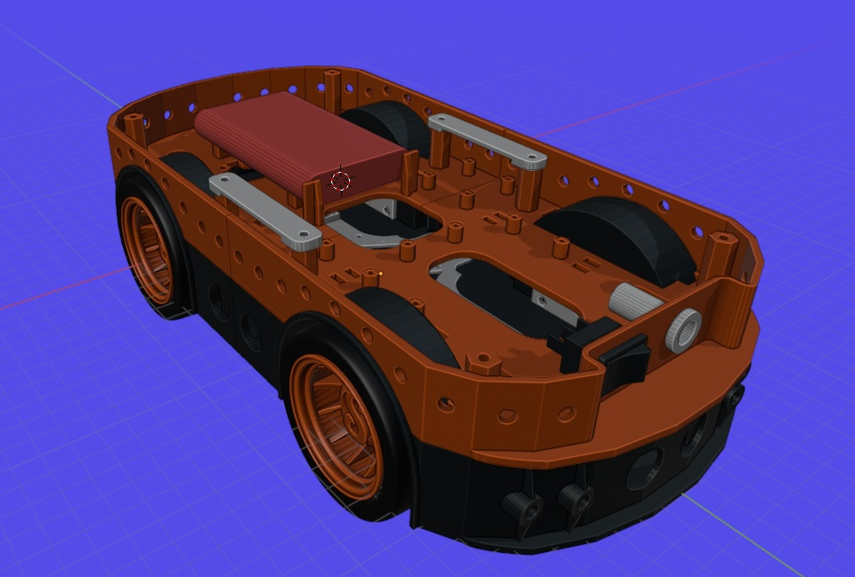
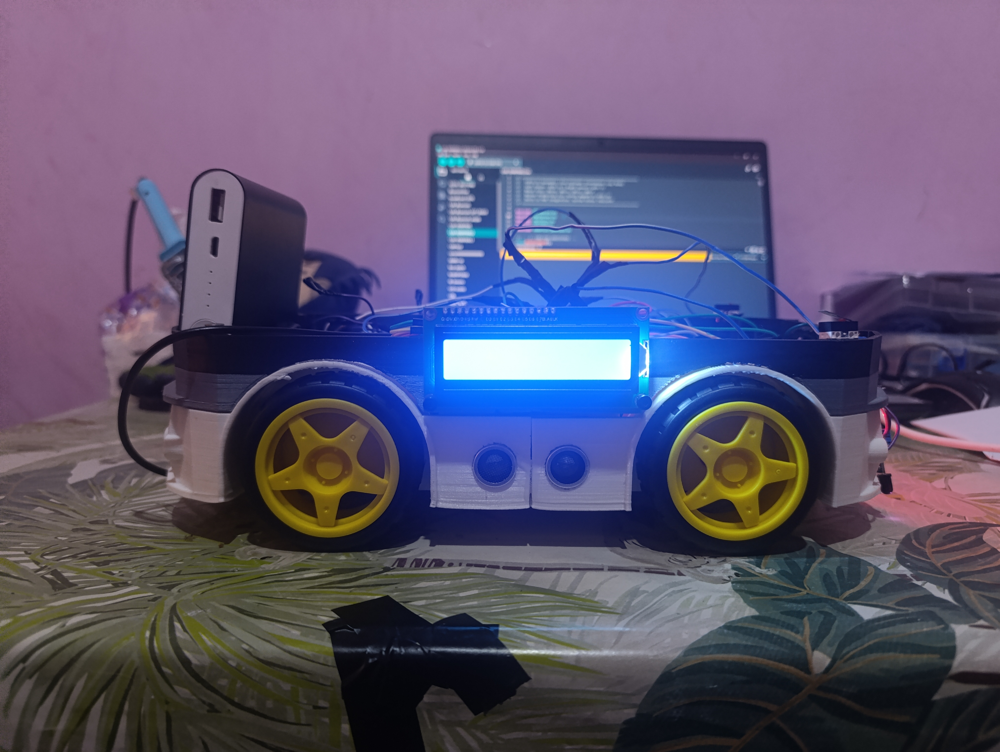

# ESP32-S3 AGV Robot

An autonomous guided vehicle (AGV) prototype built with an ESP32-S3 for line following, cargo detection, MQTT telemetry, LCD feedback, RGB status indication, buzzer alerts, and emergency stop control.

This project was developed as a mechatronics final-year project at FST Settat.

## CAD Assembly



## Final Prototype



## Features

- Line following using left and right IR sensors
- DC motor control through a motor driver
- Cargo/load detection using limit switches
- Bumper/safety switch logic
- MQTT dashboard integration with Adafruit IO
- Emergency stop command through MQTT
- 16x2 I2C LCD status display
- Onboard RGB LED status feedback
- Buzzer melodies and alerts
- Uptime, battery placeholder, delivery counter, cargo state, and robot status publishing

## Hardware

- ESP32-S3 development board
- Arduino Uno used during prototyping and tests
- Motor driver module
- DC motors and robot chassis
- IR line sensors
- Limit switches for cargo/bumper detection
- Ultrasonic sensor inputs
- 16x2 I2C LCD
- Onboard NeoPixel/RGB LED on GPIO 48
- Active buzzer
- Battery/power system

## Repository Structure

```text
firmware/   Main ESP32-S3 Arduino firmware
media/      Selected project images
models/     CAO model images and printable STL files
```

## Firmware

The main firmware is located here:

```text
firmware/ESP32-S3-AGV-Robot/ESP32-S3-AGV-Robot.ino
```

Before uploading to the ESP32-S3, replace these placeholders with your own values:

```cpp
const char* ssid     = "YOUR_WIFI_SSID";
const char* password = "YOUR_WIFI_PASSWORD";
const char* mqtt_user   = "YOUR_ADAFRUIT_IO_USERNAME";
const char* mqtt_key    = "YOUR_ADAFRUIT_IO_KEY";
```

Also update the MQTT feed topics if your Adafruit IO username or feed names are different.

## Pin Mapping

| Function | GPIO |
| --- | --- |
| IR left sensor | 12 |
| IR right sensor | 13 |
| Motor IN1 | 4 |
| Motor IN2 | 5 |
| Motor IN3 | 6 |
| Motor IN4 | 7 |
| Buzzer | 14 |
| LCD SDA | 16 |
| LCD SCL | 15 |
| Cargo switch 1 | 17 |
| Cargo switch 2 | 18 |
| RGB LED | 48 |
| Ultrasonic trigger | 46 |
| Ultrasonic back | 8 |
| Ultrasonic front | 9 |
| Ultrasonic left | 10 |
| Ultrasonic right | 11 |

## Required Arduino Libraries

- `WiFi`
- `PubSubClient`
- `Wire`
- `LiquidCrystal_I2C`
- `Adafruit_NeoPixel`

## CAD Models

The STL files used for the chassis/body parts are included in:

```text
models/printable-models/
```

Reference render images are included in:

```text
models/cao-models/
```
